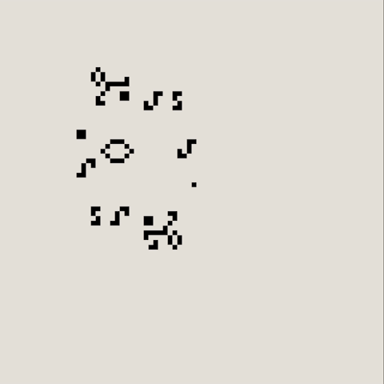

<a id="readme-top"></a>

# Colorful Conway's Game of Life

A Python implementation of Conway's Game of Life using **Python** and **Pygame**. This project adds colors to each living cell and allows you to draw on the grid when the game is paused.
</br> [Play it here !](https://chivalryincode.itch.io/conways-game-of-life)

## Table of Contents
- [Overview](#overview)
- [Gameplay-Controls](#gameplay-controls)
- [Project-Structure](#project-structure)
- [How-to-try-it?](#how-to-try-it)
- [Customization](#customization)
- [License](#license)
- [Credits](#credits)

## Overview
This project was made to push my understanding of programming fundamentals and the use of a graphics library like **Pygame**. I used **Python** for all the logic—managing a grid to track cell placement and **Pygame** for rendering.
<br />
<br />
The rules of Conway's Game of Life are :
1. Any live cell with fewer than two live neighbours dies, as if by underpopulation.
2. Any live cell with two or three live neighbours lives on to the next generation.
3. Any live cell with more than three live neighbours dies, as if by overpopulation.
4. Any dead cell with exactly three live neighbours becomes a live cell, as if by reproduction.



<p align="right">(<a href="#readme-top">back to top</a>)</p>

## Gameplay Controls
- Left mouse : Draw on the grid by adding or remove a cell.
- Space key : Start or pause the game.

<p align="right">(<a href="#readme-top">back to top</a>)</p>

## Project Structure
├── README.md (this file) <br />
├── ccwgol.gif <br />
├── color.py <br />
└── colorful_conway_s_game_of_life.py <br />

- **colorful_colorful_conway_s_game_of_life.py**: The main script containing the game loop and logic.
- **color.py**: A file containing RGB tuples for different colors used in the game.

<p align="right">(<a href="#readme-top">back to top</a>)</p>

## How to try it?
### On navigator
You can play it on Itch.io [here](https://chivalryincode.itch.io/conways-game-of-life).

### On your computer
1. **Download** this repository :
   ```bash
   git clone https://github.com/Steenkiste/Colorful-Conways-Game-of-Life.git
2. Install all dependencies :
   - Install [Python](https://www.python.org/downloads/) (Python 3.10 or higher recommended).
   - Install [Pygame](https://www.pygame.org/download.shtml) using pip :
        ```bash
         pip install pygame
5. Run the game using python :
   ```bash
   python colorful_conway_s_game_of_life.py

<p align="right">(<a href="#readme-top">back to top</a>)</p>

## Customization
- Grid Size: Adjust **GRID** in colorful_conway_s_game_of_life.py (default is 80).
- Colors: Edit **COLORS** in color.py to change available colors.
- Speed: Adjust **WAIT_TIME** in colorful_conway_s_game_of_life.py to change simulation speed (default is 80).

<p align="right">(<a href="#readme-top">back to top</a>)</p>

## License
This project is licensed under the [MIT License](LICENSE). You are free to use, modify, and distribute this project under the terms of the license.

<p align="right">(<a href="#readme-top">back to top</a>)</p>

## Credits
Conway's Game of Life rules: [Wikipedia](https://en.wikipedia.org/wiki/Conway%27s_Game_of_Life)
<br /> Pygame (https://www.pygame.org/)

<p align="right">(<a href="#readme-top">back to top</a>)</p>
